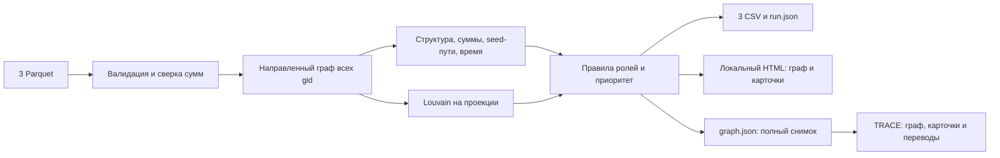

# Граф денег — HackAlem AI

Локальное рабочее место AML-аналитика. По трём Parquet-файлам строит направленный граф, присваивает каждому клиенту объяснимую структурную роль, выделяет сообщества и формирует очередь проверки. Выводы — гипотезы, не утверждения о виновности.

Основной сценарий полностью работает **без API-ключа, интернета, GPU и платных сервисов**. AI-агент Codex использован при разработке. Дополнительный прежний OpenAI-каркас сохранён отдельно в `src/`; графовые роли он не определяет.

## Быстрый запуск

Требования: Python **3.11 или 3.12**; браузер с Canvas и BigInt. Node.js 22+ нужен только для npm-команд и тестов старого LLM-каркаса. Docker не нужен.

Поддерживаемые и проверяемые версии Python — 3.11/3.12; для других версий создайте окружение с одной из них. Совместимость закреплённых зависимостей с Python 3.13+ здесь не заявляется. Docker, GPU и внешние сервисы не используются.

Первичная установка в Windows PowerShell из корня репозитория:

```powershell
py -3.12 -m venv .venv
.\.venv\Scripts\python.exe -m pip install -r requirements.txt
```

Linux/macOS:

```bash
python3 -m venv .venv
.venv/bin/python -m pip install -r requirements.txt
```

Если Python не установлен, установите Python 3.12 с python.org; служебный Python Codex не является требованием проекта. Зависимости зафиксированы в `requirements.txt`; интернет требуется для их первоначальной установки.

Распакуйте выданный организаторами архив так, чтобы в `data/` находились `nodes.parquet`, `edges.parquet`, `transactions.parquet`. Исходные данные не входят в Git. Можно указать другой каталог через `--data`.

**Один запуск от сырых Parquet до всех результатов:**

```powershell
.\.venv\Scripts\python.exe -m moneygraph --data data --out artifacts
```

На Linux/macOS используйте `.venv/bin/python` вместо `.\.venv\Scripts\python.exe`. Откройте `artifacts/report.html` обычным браузером: файл самодостаточен, сервер не обязателен.

Для расчёта и локального просмотра через HTTP одной командой:

```powershell
.\.venv\Scripts\python.exe -m moneygraph --data data --out artifacts --serve
```

Откройте http://127.0.0.1:8765/report.html. Остановка — Ctrl+C. Порт меняется через `--port`. Сервер слушает только 127.0.0.1, внешняя публикация не выполняется.

При установленном Node.js доступны сокращения:

```sh
npm run analyze
npm start
```

Они используют Python из `.venv`. `npm install` не нужен. Для другого Python можно задать `PYTHON`. Настройки правил: `--config config/roles.json`.

### Интерфейс TRACE

Расчёт копирует TRACE в `artifacts/frontend/`. После запуска с `--serve` откройте http://127.0.0.1:8765/frontend/: интерфейс загрузит соседний `graph.json`. Сервер только раздаёт локальные файлы. Без сервера откройте `artifacts/frontend/index.html` и выберите `artifacts/graph.json` кнопкой «Импорт данных». Все карточки и страницы переводов читаются из одного загруженного файла.

Контракт формата перенесён из ветки `Zhans` (`bdbbb65`): [BACKEND_CONTRACT.md](BACKEND_CONTRACT.md). Разбор отличий от приложенного handoff: [docs/BACKEND-HANDOFF-REVIEW.md](docs/BACKEND-HANDOFF-REVIEW.md).

## Что реализовано

- Загрузка и валидация трёх Parquet: поля, типы, суммы, даты, уникальные gid, концы рёбер, соответствие сумм и числа транзакций.
- Все узлы, включая seed без рёбер, сохраняются в графе и выгрузках.
- Шесть ролей с правилами и числовыми объяснениями до 200 символов.
- Кластеры Louvain, число seed, внутренний оборот, лидеры и гипотеза по каждому кластеру.
- Топ-50 приоритетов с объяснением вклада признаков; на небольших наборах — все доступные узлы.
- Офлайн-интерфейс: точный поиск gid, стрелки потоков, раскраска по ролям или кластерам, фильтры, масштаб и перемещение, окружение на 1–2 шага, карточки и CSV-экспорт.
- Временной признак: совместимость входа и выхода в окне 0–2 календарных дней без повторного расходования одного входящего объёма.
- `run.json` с параметрами, версиями библиотек, хешами входных файлов и временем выполнения.

LLM-чат, обучение модели, выявление реальных организаторов и внешнее обогащение данных не реализованы и не требуются для обязательного сценария.

## Выходы и проверка

| Файл | Схема / назначение |
| --- | --- |
| `artifacts/nodes_roles.csv` | gid, role, role_score, cluster_id, priority_score, evidence |
| `artifacts/clusters.csv` | cluster_id, n_nodes, n_seed, sum_kzt_internal, top_gids, hypothesis |
| `artifacts/top_nodes.csv` | rank, gid, role, priority_score, why |
| `artifacts/report.html` | Самодостаточный экран просмотра; содержит данные и CSV для скачивания |
| `artifacts/metrics.json` | Метрики и ограничения наблюдаемости по каждому узлу; gid строкой |
| `artifacts/run.json` | Параметры и контроль воспроизводимости |
| `artifacts/graph.json` | Единый снимок: все узлы, связи, операции, кластеры, рейтинг, параметры и SHA256 обязательных CSV; ID строками |

CSV использует UTF-8, запятую и стандартное CSV-экранирование. `top_gids` — JSON-массив целых gid в одной CSV-ячейке. Не открывайте gid как числа с плавающей точкой в Excel: импортируйте колонку как текст, чтобы сохранить все цифры. В pandas используйте `dtype={'gid':'int64'}`. В браузере gid всегда строка: идентификаторы этого набора больше 2^53.

Проверить уже записанные файлы перед передачей жюри (без изменения данных):

```powershell
.\.venv\Scripts\python.exe -m moneygraph.verify --data data --out artifacts
```

Успех: JSON `status: "ok"` и код выхода 0. Повреждение, неполный экспорт, расхождение CSV/JSON или изменение исходных файлов дают ошибку в stderr и код 1. Проверяются схемы, все gid и операции (включая повторы), суммы и количества, размеры/обороты кластеров, порядок рейтинга, хеши и время расчёта ≤300 секунд. Если расчёт использовал другой конфиг, передайте тот же `--config`. Проверка согласованности не подтверждает истинность ролей и не заменяет предметные тесты.

**Хранение:** отдельной БД в MVP нет. `data/*.parquet` — исходный снимок; pandas и NetworkX работают в памяти; CSV/JSON — рассчитанные файлы. По ТЗ требуется разовый батч, онлайн-поток и SQL-БД не требуются. `src/` и прежняя JSON-память LLM не участвуют в хранении графа. Краткая передача бэкенда команде: [docs/BACKEND-READY.md](docs/BACKEND-READY.md).

На предоставленном наборе проверено: **2248 узлов, 3119 рёбер, 4840 транзакций, 81 seed, 19 изолятов, 444 обрезанных узла**, оборот 365890012.01 KZT. Центральность по умолчанию рассчитывается точно; время актуального полного запуска записано в `run.json`. Это не гарантия скорости на любом оборудовании.

С конфигурацией по умолчанию получено 105 кластеров, 50 строк приоритетов и роли:

| Роль | Число узлов |
| --- | ---: |
| consolidator | 25 |
| transit | 26 |
| distributor | 85 |
| terminal | 1071 |
| coordinator | 57 |
| peripheral | 984 |

Все 444 обрезанных узла исключены из `terminal`. Число сообществ вычисляется, а не подгоняется под примечания ТЗ. В полном графе 35 слабосвязных компонент: 16 компонент с рёбрами + 19 изолятов. Числа выше — результаты на выданных файлах, не константы алгоритма.

После P0 число `transit` уменьшилось с 65 до 26: 39 прежних меток больше не проходят обязательную проверку времени и объёма. Это изменение правила, не потеря узлов. Ещё 9 смен ролей вызваны переходом к точной центральности. Из 26 кандидатов 7 проходят порог при исключении совпадений внутри дня; для 19 результат зависит от неизвестного внутридневного порядка. Карточка показывает оба сценария. Для `peripheral` сохранены код и текст причины: изоляция, обрыв, неполный вход seed, отсутствие положительного входа либо несрабатывание правил.

Для проверки жюри: запустить команду, проверить три CSV, открыть HTML, ввести произвольный gid из nodes.parquet и посмотреть связи/основания роли. Для изолята экран покажет один узел и отсутствие наблюдаемых связей. В карточке depth=4 будет предупреждение об обрыве.

## Архитектура



| Компонент | Ответственность |
| --- | --- |
| `moneygraph/io.py` | Чтение и валидация, перевод сумм в целые сотые KZT |
| `moneygraph/analysis.py` | Метрики, кластеры, роли, ранжирование |
| `moneygraph/report.py` | Проверка выходного контракта, CSV, безопасная сериализация HTML |
| `moneygraph/snapshot.py` | Строковые ID, операции без удаления повторов, идентификатор снимка и хеши CSV |
| `moneygraph/verify.py` | Приёмка записанных CSV/JSON по исходным Parquet, без записи файлов |
| `frontend/` | TRACE из Zhans: полный граф, карточка, постраничные операции, локальный импорт |
| `moneygraph/viewer.html` | Canvas-граф и элементы просмотра без сторонних ресурсов |
| `moneygraph/__main__.py` | Один запуск, время, хеши, локальный сервер |
| `config/roles.json` | Пороги и веса |
| `starter/` | Исходная заготовка организаторов, сохранённая для атрибуции |
| `tests/` | Предметные тесты на Python |
| `src/`, `test/` | Отдельный прежний Node.js LLM-каркас и его QA |

Из starter использована идея загрузки, базовых метрик и схем выгрузок. Добавлена фактическая сверка чисел и включение изолятов в граф. Исходный `starter.py` — справочная заготовка с пустыми ролями; запускать для сдачи нужно `moneygraph`.

## Формальные критерии ролей

Обозначения: din/dout — число разных контрагентов без самопереводов; I/O — наблюдаемые вход/выход в графе. `r=O/I` определён только при I>0. `seed_reach` — число различных seed, от которых есть направленный путь длиной ≤4; сам узел не засчитывается своим seed-путём. Такие пути не доказывают происхождение конкретных денег.

| Роль | Основное правило по умолчанию |
| --- | --- |
| coordinator | din+dout≥4; betweenness>0 и не ниже 90-го перцентиля среди активных узлов; связи с ≥2 чужими кластерами; seed_reach≥3 |
| distributor | dout≥5 и dout≥2×max(din,1) |
| consolidator | din≥5 и seed_reach≥2 |
| transit | Не seed, не обрезан, I>0, din>0, dout>0, 0.8≤r≤1.2; совместимый объём M за 0–2 дня покрывает ≥80% входа и ≥80% выхода |
| terminal | Не seed, не обрезан, I>0 и dout=0; только кандидат внутри наблюдаемой выборки |
| peripheral | Ни одно из правил выше не выполнено |

При пересечении правил основная роль выбирается в порядке строк этой таблицы. В карточке сохранены все сработавшие роли. Betweenness — направленная, невзвешенная по расстоянию, точная (`centrality_mode=exact`, `k=None`). Явный режим `approximate` использует до `betweenness_samples` источников с seed=42. Денежная сумма не интерпретируется как длина пути. Из-за совпадения значений на границе перцентиля доля кандидатов может отличаться от 10%.

`role_score` — сила соответствия правилу, **не калиброванная вероятность**. База 0.60, по 0.10 за каждый из трёх дополнительных критериев:

| Роль | Дополнительные критерии |
| --- | --- |
| coordinator | seed_reach≥5; чужих кластеров≥3; активных дней≥3 |
| distributor | dout≥10; активных дней≥3; out_tx≥2×dout |
| consolidator | din≥10; seed_reach≥3; r≤0.3 при допустимости отношения |
| transit | 0.9≤r≤1.1; обе временные доли ≥0.8 при исключении совпадений внутри дня; активных дней≥3 |
| terminal | din≥2; in_tx≥3; активных дней≥3 |

Максимум 0.90. Для обрезанных узлов максимум 0.60; peripheral получает 0.20. У seed и обрезанных узлов отношение не используется для выводов об удержании. Правила и дополнительные критерии эвристические; подлинность финансовой роли ими не устанавливается.

## Приоритет

`priority = 0.30*S + 0.25*F + 0.20*B + 0.15*D + 0.10*R`, где:

- S = min(seed_reach/5, 1);
- F — перцентиль max(I,O) среди активных узлов;
- B — перцентиль betweenness среди активных узлов;
- D — перцентиль max(din,dout) среди активных узлов;
- R — role_score; для peripheral равен 0.

Перцентиль — pandas rank(method='average', pct=True), для нулевого признака компонент 0. Изолятам priority=0. Округление до 6 знаков; сортировка по убыванию score, затем gid по возрастанию. Вклад факторов виден в карточке; `why` содержит два крупнейших вклада и evidence. Периферийный узел может иметь высокий приоритет по структуре и объёму: отсутствие ролевого шаблона не равно низкому приоритету.

## Кластеры и временной признак

Для Louvain строится неориентированная проекция: вес пары — сумма переводов в обе стороны в целых сотых KZT. Самопереводы и нулевые веса не участвуют в кластеризации, но сохраняются в отчёте сумм. Изоляты — отдельные кластеры. resolution=1, seed=42, порядок узлов сортирован, cluster_id присваивается по минимальному gid сообщества. Направленный оригинал используется для потоков и ролей.

`sum_kzt_internal` складывает каждое направленное ребро внутри сообщества ровно один раз. `hypothesis` — шаблон по наиболее частой роли, числу узлов и seed; это не доказательство существования организованной группы. В случае одинаковых частот используется порядок записей, фиксированный сортировкой gid.

Временной признак сопоставляет дневные входы и выходы FIFO в окне 0–2 дней. Каждый входящий объём расходуется не более одного раза; просроченный остаток исключается. В правило входят обе доли M/I и M/O; окно задаёт `transit_window_days`, минимальную долю — `transit_min_matched_fraction`. Отдельно рассчитывается сценарий только с более поздними датами. Самопереводы исключены из сопоставления, отношения O/I и его знаменателей `external_in_kzt`/`external_out_kzt`; публичные `in_kzt`/`out_kzt` сохраняют все наблюдаемые суммы. Старое поле `temporal_2d` сохраняет долю входа в фиксированном окне 0–2 дня. По датам без времени нельзя доказать очередность операций внутри дня или прохождение именно тех же денег.

## Тесты

```powershell
.\.venv\Scripts\python.exe -m unittest discover -s tests -v
node --test
```

Или `npm run test:graph` и `npm test`. Python-тесты проверяют контракт данных, финансовую сверку, шесть ролевых мотивов, seed/обрыв/изоляты, временное сопоставление, большие gid, воспроизводимость и полный официальный набор при наличии data/. Если официальных файлов нет, только соответствующий acceptance-тест помечается skip; остальные работают на синтетических таблицах.

На закреплённых библиотеках проверена **побайтовая идентичность трёх CSV между Python 3.11.9 и 3.12.14**, а также неизменность содержательных полей JSON после двух перестановок строк всех исходных таблиц. Это проверка воспроизводимости на данном наборе, не гарантия для любых будущих версий библиотек. Повторить с двумя подготовленными окружениями:

```powershell
.\.venv\Scripts\python.exe scripts/check-reproducibility.py --python-b PATH_TO_PYTHON_311
```

Отчёт проверки: `artifacts/verification/reproducibility.json`. Время исполнения и хеши переписанных исходных Parquet не сравниваются как содержательные результаты.

Проверено: 44 предметных Python-теста проходят. Последняя проверка неизменённого Node-кода — 83 теста (66 прежнего каркаса и 17 TRACE). История исправлений и актуализации QA описана в `docs/QA-RESOLUTION.md`. При реализации QA-файлы не редактировались; обновлённый набор поступил отдельно во время работы. Реальных платных запросов OpenAI в тестах нет.

## Данные, приватность и ограничения

- Только выданные организаторами обезличенные данные: июль 2026, исходящие переводы от 81 seed, глубина 4, внутри одного банка, суммы ≥5000 KZT.
- **Нулевой выход на depth=4 — обрыв обхода**, а не доказательство накопления. У seed входящий поток неполон. Даже при depth<4 terminal означает лишь отсутствие наблюдаемого выхода за период.
- I−O не является балансом счёта. O>I не объявляется автоматически аномалией. Объём рёбер — оборот с возможным повторным учётом тех же денег на разных шагах.
- Нет атрибутов клиента, ground truth и подтверждённых ролей. Accuracy не заявляется. Пороги требуют экспертной проверки; результаты исследования чувствительности не являются оценкой точности по истинным ролям.
- Валидация принимает денежную точность до двух знаков и сверяет целые сотые KZT. Совпадающие строки транзакций не удаляются без идентификатора операции.
- Контракт ID — неотрицательный int64, без промежуточного float. Числовые даты и смешанные часовые пояса отклоняются до расчёта; календарные дни не пересчитываются в UTC. Некорректная структура конфигурации и булевы веса возвращают ошибку, а не подставляют настройки молча.
- UI показывает максимум 25 крупнейших связей каждого направления в текстовом списке карточки; граф/выгрузки содержат все связи. Отбор подграфа на экране не меняет расчёт.
- HTML содержит весь локальный набор и производные результаты. Не публикуйте его и CSV вне разрешённого контура. `data/`, Parquet и `artifacts/` исключены из Git; обязательные выгрузки передаются жюри разрешённым способом.
- Расчёт CPU-only, без сетевых обращений. Публикация в интернете не нужна; deployed-версии нет.
- Файлы заменяются по одному атомарно, но весь набор экспортов не является единой файловой транзакцией; при сбое записи повторите запуск. После неуспешного запуска старые выгрузки нельзя считать свежими.

## Масштабирование до ~1 млн узлов

Python-объекты NetworkX и полная отрисовка не подходят для такого объёма без пересмотра архитектуры. Читать Parquet батчами через Arrow/DuckDB, агрегировать транзакции заранее; использовать компактное графовое представление/igraph либо специализированный движок. Оставить приближённую центральность, ограничить глубину обходов; хранить результаты в БД и отдавать только нужные подграфы. Кластеризацию и обновление признаков выполнять пакетно/инкрементально. GPU возможен, но не обязателен. Скорость и память измерять заново: обещания прежних 5 минут нет.

## Отдельный LLM-каркас и исправления QA

Для прежней демонстрации: `npm run llm:demo -- --offline "Привет"`. Она не относится к графовой классификации. Для API скопируйте `.env.example` в `.env`, укажите `OPENAI_API_KEY`; реальный API в этой работе не вызывался.

Настройки: OPENAI_MODEL (gpt-4.1-mini), OPENAI_TIMEOUT_MS (10000), OPENAI_BASE_URL (полный URL Responses, по умолчанию https://api.openai.com/v1/responses), OPENAI_MAX_RESPONSE_BYTES (1048576), MEMORY_PATH (./.local/memory.json). Пустые/пробельные строки используют defaults. Endpoint требует HTTPS, HTTP разрешён только loopback; перенаправления запрещены. Совместимость Azure отдельной заменой URL не обещается.

Клиент использует strict Structured Outputs, таймаут и потоковый лимит тела; ошибки HTTP отменяют тело без логирования. Коды включают missing_api_key, http_N, timeout, refusal, incomplete_response, invalid_output, response_too_large, request_failed, client_error, configuration_error. Ошибка подключения зависимости явно отличается от мусорного вывода LLM. Исходная причина сохраняется в Error.cause, но не выводится с секретами.

Память сериализует append между процессами через эксклюзивный lock-файл, ожидает не более 10 секунд, проверяет устаревший lock и живой PID. При порче контейнера делает backup; при неверной отдельной записи сохраняет остальные. Неизвестный непустой source допускается для совместимости. Хранит 100 последних записей и 2 свежие .corrupt-копии (maxBackups настраивается). Сбой хранения не теряет готовый ответ, memorySaved — boolean. Защиты от сбоя питания без fsync нет; PID reuse может задержать восстановление lock, в таком случае приложение завершит попытку записи по таймауту.

## Демо на 5 минут

1. Проблема и ограничения данных — 30 секунд.
2. Живой запуск и три выгрузки — 45 секунд.
3. Топ приоритетов и основания роли одного узла — 60 секунд.
4. Поиск произвольного gid жюри, связи и карточка — 60 секунд.
5. Пример depth=4: почему это не доказанный конечный получатель — 45 секунд.
6. Кластеры, следующий запрос аналитика и ограничения — 60 секунд.

Перед сдачей: выполнить проверки, убедиться в отсутствии секретов/датасета в Git, отправить код в выданный командный репозиторий и отдельно нажать «Сдать решение» на платформе. Подробности правил участия: `docs/HACKATHON_AUDIT.md` (исторический аудит до переделки).
