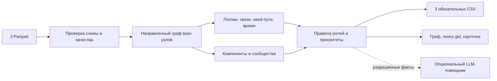

# «Граф денег»: предложение решения и план на 5 часов

> Исторический план до реализации. Предметное ядро и автономный HTML уже реализованы; фактические команды, критерии и ограничения см. в корневом README.md. Streamlit/PyVis заменены самодостаточным Canvas-интерфейсом без дополнительных зависимостей.

Статус: проектирование. Архивы data (1).zip и starter (1).zip предоставлены; состав и starter прочитаны, строки Parquet пока не исследованы. Численные пороги ниже — стартовые гипотезы для проверки. Это не реализованные функции и не результаты анализа клиентов.

## Продукт и основной сценарий

Локальное рабочее место AML-аналитика: загрузить три Parquet, получить воспроизводимые роли и приоритеты, открыть граф и карточку любого gid, выгрузить три обязательных CSV. Основной вопрос: «кого проверить первым и на каких наблюдаемых признаках основан приоритет».

Не делаем заключений о виновности. Роль — структурная гипотеза, score — сила соответствия правилам, не вероятность преступления и не статистически откалиброванная уверенность.

Основной расчёт не зависит от LLM, API-ключей, GPU, облака и внешних данных. AI-агент используется при разработке; необязательный LLM-помощник работает поверх уже рассчитанных фактов.

## Стек и устройство

Предложение: Python + pandas/pyarrow + NetworkX; локальный интерфейс Streamlit с интерактивным графом, например через PyVis с локально включёнными JS/CSS. Финальный выбор визуального компонента проверить на старте коротким прототипом. Не загружать графовые библиотеки с CDN во время демо.

Python выбран под Parquet, графовые алгоритмы и предоставленный организаторами starter. Используем starter как основу: расширяем его проверки сумм/числа транзакций и включаем изоляты в сам граф; подробности в HACKATHON_AUDIT.md. Текущий Node-каркас сохраняется как заготовка LLM-интеграции; не тратим время на поддержку двух backend ради демо. Если переносим помощника в Python, переносим проверяемые свойства клиента: schema, таймаут, валидацию и fallback.

Официальные справочники: [pandas read_parquet](https://pandas.pydata.org/docs/reference/api/pandas.read_parquet.html), [NetworkX Louvain](https://networkx.org/documentation/stable/reference/algorithms/generated/networkx.algorithms.community.louvain.louvain_communities.html). Louvain имеет настройки weight, resolution и seed; фиксируем их, версии библиотек и порядок узлов.

Планируемые модули: `moneygraph/io.py`, `quality.py`, `metrics.py`, `roles.py`, `clusters.py`, `ranking.py`, `export.py`, `cli.py`, `ui.py`. Пороги — в `config/roles.json`; тестовые синтетические данные — отдельно от официальных. Это предлагаемая структура, файлов пока нет.

Целевая команда после установки окружения: `python -m moneygraph run --data data --out artifacts`. Она должна создавать три CSV и локальный просмотр/данные просмотра; режим `--serve` открывает сервер только на 127.0.0.1. Конкретные команды фиксируем после реализации. Чистая установка описывается отдельно; никаких путей к Python Codex в README запуска.

## 1. Проверка данных

- Читать список узлов из nodes.parquet и добавлять ВСЕ gid до рёбер: seed без рёбер нельзя потерять.
- Проверять обязательные колонки, типы, уникальность gid, существование концов рёбер, конечные неотрицательные суммы, даты, depth и is_seed. Нулевые веса, петли и повторы обрабатывать явно.
- Не суммировать edges и transactions вместе: это два представления одних переводов. Агрегировать transactions по src,dst и сверить sum_kzt/n_tx с edges. Расхождения отражать в отчёте, не исправлять молча.
- Не удалять одинаковые транзакционные строки автоматически: без transaction_id одинаковые строки могут быть настоящими отдельными переводами.
- Денежные суммы считать в точном согласованном с README представлении; идентификаторы не преобразовывать во float. В JSON для браузера int64 gid передавать строкой, в CSV сохранять десятичное целое.
- Размеры 2248/3119/4840, 81 seed, июль 2026 и оборот — контрольные ожидания для официального набора, не зашитая логика классификации.
- В ТЗ есть арифметическая неоднозначность: 2248 − 1877 = 371, а вне крупнейшей компоненты указано 352. Разница 19 совпадает с числом seed без рёбер. Возможное объяснение: компоненты описаны только для узлов с рёбрами. Проверить на данных; не навязывать ровно 16 компонент всему nodes.parquet.

## 2. Метрики и ограничения наблюдения

Для каждого узла: число уникальных входящих/исходящих контрагентов, наблюдаемые вход/выход в KZT, n_tx, активные дни, depth, is_seed, компонента, сообщество, число различных seed с направленным путём до узла длиной до 4, доля межкластерных связей, приближённая betweenness.

Обозначения: `din/dout` — уникальные контрагенты; `I/O` — наблюдаемые вход/выход; `r=O/I` только при I>0. Отношения описывают выборку, не полный баланс счёта. `I-O` нельзя называть остатком.

Защита от ошибок интерпретации:

1. `depth=4 && dout=0`: признак обрезанной наблюдаемости. Запрет terminal на этом основании; запрет признака удержания для consolidator. Наблюдаемый fan-in всё ещё информативен. Показывать флаг в карточке и evidence.
2. Seed: не использовать r и I-O для выводов об удержании или пропуске — входящий поток занижен.
3. I=0 или O>I: не «достраивать» скрытые деньги и не объявлять автоматически аномалией. Вывести ограничение видимости.
4. Даже при depth<4 нулевой выход означает отсутствие наблюдаемых переводов в этой выборке. Межбанк, переводы <5000 KZT, следующий месяц и остатки не видны.
5. Пути от seed показывают связь в наблюдаемой сети, не доказанное происхождение всех средств. Нельзя считать всю сумму вдоль цепочки одной и той же денежной массой.

## 3. Начальные критерии ролей

Все пороги — конфигурация для первичного baseline, не найденные факты датасета. Сначала проверяем их на синтетических мотивах, затем смотрим распределения реальных данных без хардкода gid.

| Роль | Стартовый критерий | Ограничение |
| --- | --- | --- |
| consolidator | din≥5 и ≥2 различных seed-пути; дополнительный признак r≤0.3 только для не-seed, depth<4, I>0 | На границе можно говорить о сборе от нескольких узлов, нельзя говорить, что деньги остались |
| distributor | dout≥5 и dout≥2×max(din,1) | Число получателей само по себе не доказывает нелегальную деятельность |
| transit | не-seed, depth<4, I>0, din≥1, dout≥1, 0.8≤r≤1.2 | Это сходство наблюдаемых сумм; временной паттерн усиливает, но не доказывает сквозной перевод |
| terminal | не-seed, depth<4, I>0, dout=0 | Только кандидат в конечные получатели в наблюдаемом периоде |
| coordinator | din+dout≥4; betweenness в верхних 10% среди активных узлов; связи с ≥2 чужими кластерами; ≥3 seed-пути | Осторожная гипотеза структурного посредника, не установленный организатор |
| peripheral | ни один критерий не выполнен, включая изолированные узлы | Недостаток признаков не означает отсутствие риска |

Пересечения разрешаются детерминированно: coordinator → distributor → consolidator → transit → terminal → peripheral. Все сработавшие правила показываются в карточке, одна основная роль — в обязательном CSV. Проверить, не скрывает ли приоритет правил полезные роли, на синтетических смешанных мотивах.

`role_score`: в первой версии прозрачный rule-support score, не обученная вероятность. Пример спецификации: 0.60 за основной критерий +0.10 за каждый из максимум трёх независимых подтверждающих признаков, предел 0.90; для вывода с существенной неполнотой ограничить 0.60. Список дополнительных признаков по роли формализовать в config до реализации, не назначать числа вручную для отдельных gid. Для peripheral по умолчанию 0.20: это слабость оснований для содержательной классификации.

Подтверждения не должны повторять основной критерий другими словами. Возможные подтверждения: устойчивость при изменении порогов, активность в несколько дней, для transit — временное совпадение, для coordinator — дополнительная центральность. Если не успеваем обосновать эти признаки, используем более простой явно документированный дискретный score по правилам.

`evidence` генерируется шаблоном, содержит конкретные значения и ограничение, ≤200 символов. Формулировка: «Признаки консолидации: 9 плательщиков, связь с 3 seed; исходящие 12% наблюдаемого входа. Полный баланс неизвестен». Это пример формата, не результат на официальных данных.

## 4. Приоритет и кластеры

Предлагаемый priority_score:

`0.30*seed_reach + 0.25*flow + 0.20*bridge + 0.15*fan + 0.10*role_support`.

Все компоненты в [0,1]: seed_reach=min(n_reachable_seed/5,1); flow=перцентиль log1p(max(I,O)); bridge=перцентиль приближённой betweenness; fan=перцентиль max(din,dout); role_support=role_score для содержательных ролей и 0 для peripheral. Перцентили считать среди активных узлов, фиксировать правило связок; при нулевой метрике компонент 0. Изолированным узлам priority=0.

В ранжировании не используем I-O как накопление и не повышаем приоритет просто за is_seed. score выражает порядок проверки, не вероятность виновности. Неполноту наблюдения показываем отдельно: автоматически понижать все depth=4 тоже опасно, можно скрыть важных получателей.

Сортировка: priority_score по убыванию, gid по возрастанию при равенстве. `why` показывает самые весомые факторы и ограничения. Топ — 20 или больше; для маленьких тестовых наборов все доступные узлы. Чувствительность весов ±20% проверяем через пересечение top-20, без заявления об accuracy.

Кластеры: сначала слабосвязные компоненты; внутри нетривиальных компонент — Louvain на неориентированной проекции. Вес пары = сумма направленных сумм в обе стороны; направленный оригинал сохраняется для ролей, сумм и UI. Изоляты — отдельные сообщества. Петли учитываются в отчёте сумм, но отдельно решается их исключение из Louvain и уникальных контрагентов. Фиксированный seed, сортировка входа и канонические cluster_id по минимальному gid.

Для каждого кластера: n_nodes, n_seed, сумма исходных направленных рёбер с обоими концами внутри, top_gids (например, top-5 в JSON-массиве внутри CSV-поля), hypothesis из шаблона по доминирующим ролям. Кластер — структурное сообщество, не доказанная преступная группа. Не пытаться насильно получить «8 сообществ» из примечания ТЗ.

## 5. Экран и экспорты

Экран: слева фильтры роли/кластера и поиск точного gid, в центре схема со стрелками, справа карточка выбранного узла, снизу top-20 и экспорт. Для legibility — обзор кластеров и окружение выбранного узла на 1–2 шага с переключением полного графа. Любой gid должен находиться, включая изолят и depth=4.

Цвет — роль, фильтр/обводка — кластер, размер — приоритет, особый контур — seed, пунктир — обрезанная наблюдаемость. Показывать легенду. При ограничении количества рёбер явно обозначать, что экран показывает подграф; расчёты выполняются по полному набору.

Обязательные CSV без изменения схемы:

- `nodes_roles.csv`: gid,role,role_score,cluster_id,priority_score,evidence.
- `clusters.csv`: cluster_id,n_nodes,n_seed,sum_kzt_internal,top_gids,hypothesis.
- `top_nodes.csv`: rank,gid,role,priority_score,why.

Вспомогательные метрики и flags — в отдельном локальном файле/карточке. В build_report.json: версии, конфигурация, хеши входов, длительность, статистика качества. Технические поля не перегружают основной экран.

## 6. Опции по остаточному времени

Первый приоритет: временной транзит и карточка «чего не хватает для проверки». Дневная агрегация и сопоставление входящих/исходящих объёмов в окне 0–2 дня без многократного использования одной суммы; при наличии лишь дат не выводить порядок операций внутри дня. Назвать метрику совместимостью потоков, не доказанной трассировкой конкретных денег.

Второй приоритет: вопрос «кто общий получатель этих gid?» через локальную графовую функцию; LLM только переводит запрос в разрешённую структуру операции и объясняет проверенные факты. Никакого произвольного исполнения Python/SQL от модели. Ссылки gid должны существовать, числа сверяться; при отказе/таймауте — шаблонный ответ.

Потом: циклы ограниченной длины, устойчивость сети при удалении top-N с оговоркой, что структурный распад не прогнозирует поведение реальных людей. GPU, обучение GNN, поиск персональных атрибутов и сложный агентный оркестратор в MVP не нужны.

## План пяти часов

Время отсчитывается от официального старта. Это план с контрольными результатами, не обещание скорости. В одиночку убрать LLM-чат и дополнительные алгоритмы, если обязательный сценарий не готов.

| Время | Работа | Критерий завершения |
| --- | --- | --- |
| 00:00–00:25 | starter, README данных, окружение, валидация трёх файлов | Все узлы загружены, расхождения и ограничения видны |
| 00:25–01:15 | Граф, степени, суммы, seed-пути, роли baseline | Каждому узлу назначена роль; тесты границы depth=4 и изолятов проходят |
| 01:15–02:00 | Кластеры, приоритет, evidence, три CSV | Схемы/диапазоны/покрытие проверяются автоматически |
| 02:00–03:00 | Интерфейс, поиск gid, стрелки, карточки, top-20 | Поиск любого узла и показ связей; работает без интернета |
| 03:00–03:35 | Приёмочные тесты, замер времени, анализ выбранных узлов | Прогон сырых данных до CSV <300 секунд; нет неверных терминальных ролей из обрыва |
| 03:35–04:05 | Временной признак или помощник, только если MVP готов | Дополнение не ломает офлайн-сценарий |
| 04:05–04:35 | README, диаграмма, установка в чистом окружении | Независимый запуск по инструкции |
| 04:35–05:00 | Проверка секретов, commit/push, сдача на платформе, репетиция | Решение принято платформой до дедлайна; пяти минут демо достаточно |

Если команда 3–4 человека: данные/метрики; роли/кластеры; UI; тесты/README/демо. Это распределение человеческих обязанностей, не запуск отдельных AI-агентов.

## Приёмочные проверки

1. Одна команда из чистого окружения создаёт все три CSV без API-ключа.
2. Множество gid в nodes_roles точно совпадает с nodes.parquet; никаких пропавших/дублированных узлов. На официальном наборе ожидается 2248 строк.
3. Разрешённые роли, заполненные поля, finite score в [0,1], evidence 1–200 символов, все cluster_id существуют.
4. Сумма n_nodes кластеров равна числу узлов, сумма n_seed — числу seed; внутренний оборот сверяется с рёбрами без двойного счёта.
5. Top ≥20 для официального набора, уникальные gid, rank от 1, убывание priority, соответствие nodes_roles.
6. Тестовые мотивы: fan-in, fan-out, транзит, терминальный кандидат, посредник между кластерами, периферия, изолят, seed с неполным входом, обрезанный depth=4, цикл, петля, нулевые потоки, int64 gid вне безопасного диапазона JavaScript.
7. Повторный прогон с теми же данными/конфигурацией даёт одинаковые CSV. Перемешивание входных строк не меняет роли и ранжирование.
8. Для трёх случайных gid объяснение выводится из тех же метрик, что использовались в правилах, а не сочиняется LLM.
9. Измерение времени от чтения сырых Parquet до закрытия CSV, отдельно время UI и необязательного LLM.
10. В README нет неподтверждённой accuracy: ground truth не предоставлен. Проверяются инварианты, мотивационные примеры и чувствительность порогов.

## Масштабирование до миллиона узлов

Заменить Python-объекты NetworkX на компактное графовое представление/igraph или специализированный движок; чтение Parquet батчами через Arrow/DuckDB; агрегировать транзакции до построения графа; отказаться от точной betweenness и полного перечисления путей/циклов в пользу выборок и ограниченных обходов. Хранить результаты и кэш подграфов отдельно, визуализировать только кластер/окружение. Louvain/Leiden выполнять на подходящем движке. Потерю точности и требования к памяти измерять; не обещать прежние 5 минут без нагрузочного эксперимента.

## Сценарий демо на 5 минут

0:00–0:30 — проблема и оговорки наблюдаемости; 0:30–1:15 — живой запуск и три CSV; 1:15–2:15 — top-20 и объяснение консолидации/распределения; 2:15–3:15 — поиск названного жюри gid; 3:15–4:15 — depth=4 и причина отказа от ложного terminal; 4:15–5:00 — кластеры, следующий запрос аналитика, ограничения и масштабирование.

Не подменять официальный прогон синтетическими результатами. Синтетические данные нужны только для разработки и явно обозначенного автономного примера.
